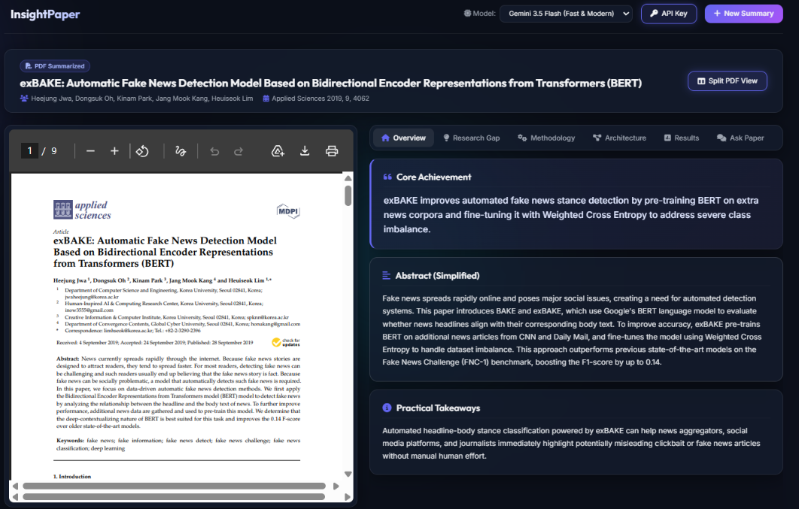
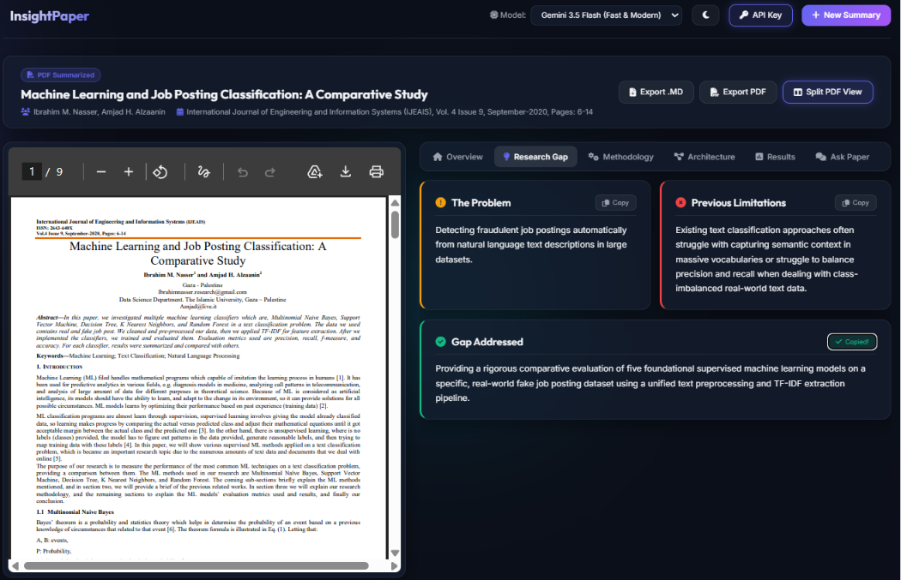
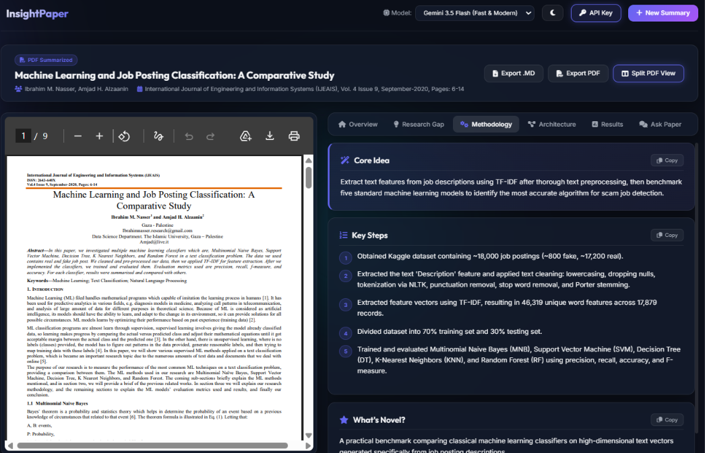
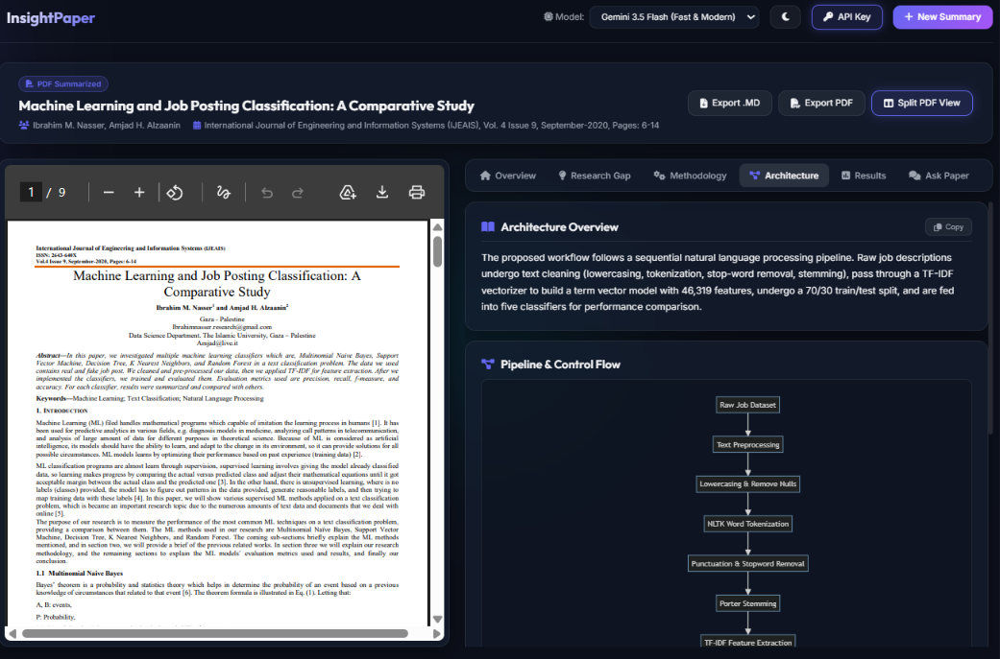
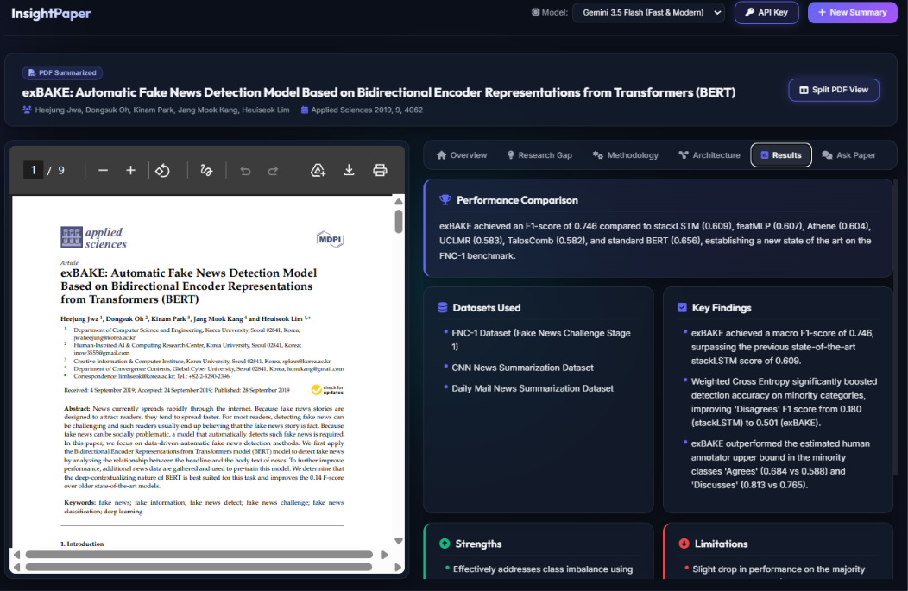
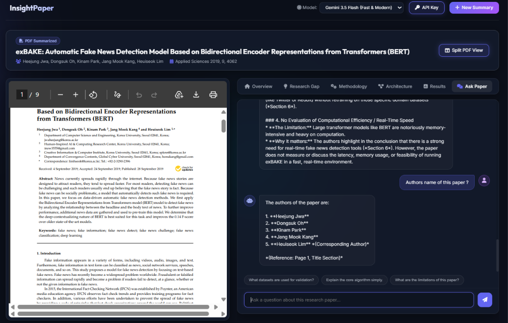

# InsightPaper 🧠📄

InsightPaper is a premium, full-stack, AI-powered Research Paper Assistant. It translates dense academic jargon into clear, structured, human-understandable sections (Overview, Research Gap, Methodology, Architecture Flowchart, Results) and provides a context-grounded Q&A chatbot to let you converse directly with the paper.

### 🚀 [Live Demo](https://insightpaper-1x9h.onrender.com/)

---

## 🌟 Visual Demo

Here is how InsightPaper looks and works:

### 1. Overview Tab
Provides a single-sentence core achievement summary, a plain-English abstract, and real-world takeaways.


### 2. Research Gap Tab
Highlights the specific problem, limitations of previous works, and the exact research gap this paper fills.


### 3. Methodology Tab
Simplifies the core breakthrough idea, details the chronological steps, and details what makes it novel.


### 4. Architecture & Pipeline Flow
Includes a structural description, modular component breakdown, and a dynamically rendered **Mermaid.js flowchart** mapping the network/pipeline data flow.


### 5. Results & Critique
Displays datasets used, performance benchmarks, core findings, and a critical analysis of strengths and limitations.


### 6. Ask Paper Tab (Q&A Chatbot)
Enables interactive conversations directly with the research paper to explain equations, clarify concepts, or fetch specific details.


---

## 🛠️ Tech Stack
- **Backend:** FastAPI (Python), Google GenAI SDK (with automatic 503/404 model-rotation fallback: Gemini 3.5 Flash ➔ 3.6 Flash ➔ 2.0 Flash ➔ 1.5 Flash).
- **Frontend:** Single Page Application (HTML5, Vanilla CSS3, Javascript ES6), Mermaid.js CDN (diagram compilers), FontAwesome, Google Fonts.

---

## 🚀 Installation & Setup

### Prerequisites
Make sure you have **Python 3.10+** and **pip** installed.

### 1. Clone the Repository
```bash
git clone https://github.com/akhileshyadav8/InsightPaper.git
cd InsightPaper
```

### 2. Install Dependencies
```bash
pip install -r backend/requirements.txt
```

### 3. Run the Application
Start the FastAPI server:
```bash
python backend/main.py
```

### 4. Open in Browser
Open your browser and navigate to:
```
http://127.0.0.1:8000
```
*(Paste your API Key in the settings modal in the top-right header, or set `GEMINI_API_KEY` in your environment variables before launching).*
*Get your GEMINI API KEY from here - `https://aistudio.google.com/app/api-keys`*

---

## 🤝 Contributing
Contributions are welcome! Please open an issue or submit a pull request.

---

## 🔗 Connect With Me

<p>
  🌐 <a href="https://akhileshyadav-portfolio-theta.vercel.app" target="_blank">Portfolio</a>
  &nbsp;&nbsp;&nbsp;|&nbsp;&nbsp;&nbsp;

  
  <a href="https://www.linkedin.com/in/akhilesh-yadav88/" target="_blank">LinkedIn</a>
  &nbsp;&nbsp;&nbsp;|&nbsp;&nbsp;&nbsp;

  
  <a href="https://github.com/akhileshyadav8" target="_blank">GitHub</a>
  &nbsp;&nbsp;&nbsp;|&nbsp;&nbsp;&nbsp;

  
  <a href="mailto:yadavakhil766@gmail.com">Gmail</a>
</p>

---

⭐ If you found this repository useful, consider giving it a star!